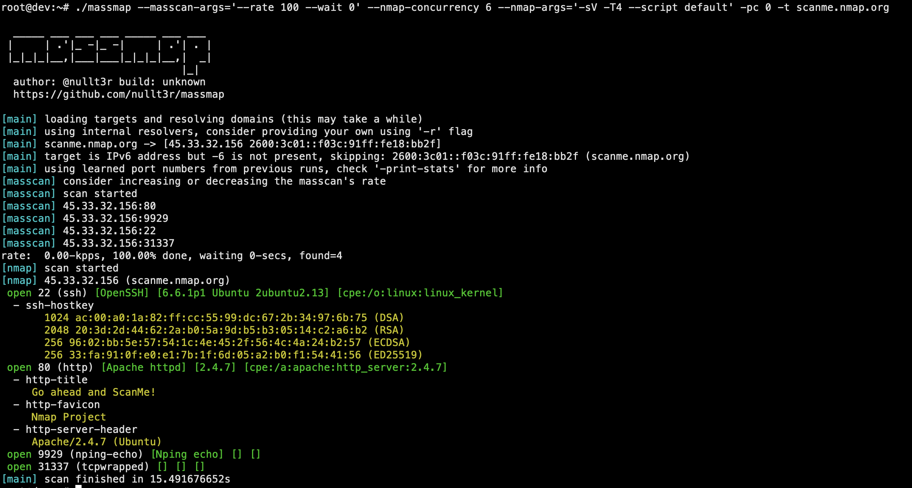

# massmap

Wraps masscan and nmap into a single workflow. Masscan finds open ports fast, nmap fingerprints them. Accepts domains, IPs, CIDRs, and IPv6. Resolves domains before scanning. Keeps a local port cache so repeated scans get smarter over time.

Masscan is great at fast port discovery, but it has two big gaps in real workflows:
- domain resolving (masscan wants IPs, not domains)
- further service identification (open port != knowing what's actually running)

Massmap solves both by resolving domains up front and automatically feeding discovered ports into nmap for service detection/fingerprinting.

This makes it a good fit for bug bounty workflows and for mapping large networks.

## How it works

1. Targets are loaded (domains resolved, scope validated, excludes applied)
2. Masscan runs against the target list
3. Discovered ports are fed into concurrent nmap scans for service detection
4. Results saved as JSON and/or `host:port` format

## Port cache

Massmap tracks which ports come up across scans. It's just a counter per port, nothing fancy. Over time this gives you a profile of your target environment. You can then scan only the top N most common ports from previous runs (`-pc N`), or all cached ports (`-pc 0`).

```
massmap -print-stats          # see what's in the cache
massmap -prune-cache 2        # drop ports seen <= 2 times
massmap -flush-cache           # nuke the cache
```

## Install

**Dependencies:** masscan, nmap, libpcap

```bash
# libpcap
sudo apt install libpcap-dev   # debian/ubuntu
sudo dnf install libpcap-devel # rhel/centos

# masscan (build from source)
git clone https://github.com/robertdavidgraham/masscan
cd masscan && make && sudo make install

# nmap
sudo apt install nmap   # or dnf install nmap
```

Download a binary from releases or build from source:

```bash
go install github.com/nullt3r/massmap/cmd/massmap@latest
# or
git clone https://github.com/nullt3r/massmap
cd massmap && go build -o massmap ./cmd/massmap
```

## Usage

Scan all ports, rate 10k, 6 nmap threads, save both output formats:
```
massmap --masscan-args='--rate 10000' --nmap-concurrency 6 --nmap-args='-sV -T4' -p 0-65535 -t x.x.x.x/xx -o output.json -ohp host_port.txt
```

Scan only previously seen ports with custom resolvers:
```
massmap --masscan-args='--rate 10000' --nmap-concurrency 6 --nmap-args='-sV -T4' -pc 0 -r resolvers.txt -t x.x.x.x/xx
```

Scope-restricted scan (only targets matching scope file):
```
massmap -p 80,443,8080 -t targets.txt -s scope.txt
```

## Options

```
Target:
  -t                  domain/IP/CIDR to scan
  -tf                 file with domains/IPs/CIDRs to scan
  -exclude-hosts      hosts to exclude (comma-separated IPs)
  -s, -scope          scope file (CIDRs, IPs, domains)

Ports:
  -p                  ports to scan (e.g. 22,80,443 or 1-65535)
  -jp                 use built-in "juicy ports" list
  -pc                 top N ports from cache (0 = all cached ports)

DNS:
  -r                  file with DNS resolvers
  -rc                 max concurrent resolutions (default: 16)

Masscan:
  -masscan-args       passthrough args to masscan (default: --rate=1000)

Nmap:
  -nmap-args          passthrough args to nmap (default: -Pn -n)
  -nmap-concurrency   concurrent nmap scans (default: 4)
  -disable-nmap       skip nmap entirely
  -disable-nmap-test  don't validate nmap args before running

Cache:
  -print-stats        show cache stats and exit
  -prune-cache N      remove ports with < N occurrences
  -flush-cache        delete the cache file
  -cache-file         custom cache file path (default: ~/.massmap/port_cache.json)

Output:
  -o                  full JSON results
  -ohp                host:port only

Other:
  -6                  enable IPv6 targets
```
